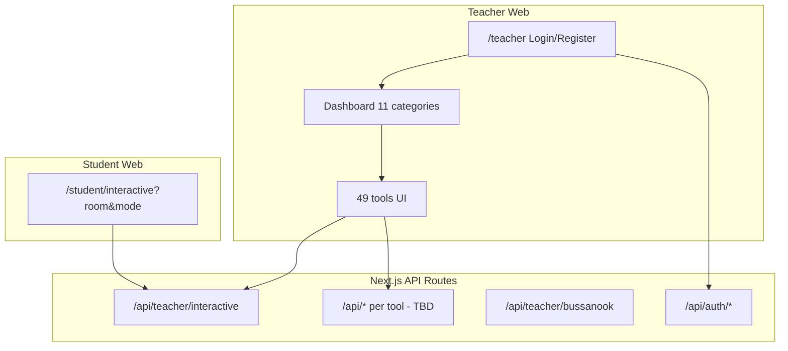

# SPUBUS MAGIC — สรุปสำหรับโคลนระบบ

เอกสารนี้สรุป “ขอบเขตงาน” ถ้าจะเขียนระบบใหม่ให้ใกล้เคียง `spubus-teacher-support.vercel.app`  
รายละเอียดเครื่องมือทีละตัว: ดู [spubus-magic-function-list.md](./spubus-magic-function-list.md)

---

## สรุปตัวเลข (ใช้วางแผนโคลน)

| รายการ | จำนวน | หมายเหตุ |
|--------|------:|----------|
| **หมวดเครื่องมือ (เมนูหลัก)** | **11** | จาก sidebar หลังล็อกอิน |
| **เครื่องมือ (ฟังก์ชันย่อย)** | **49** | 13+4+1+1+7+5+2+7+7+1+1 |
| **ฟีเจอร์แพลตฟอร์ม (นอก 49 เครื่องมือ)** | **~8** | ดูรายการด้านล่าง |
| **API path ที่ยืนยันจาก bundle/network** | **≥4** | ยังไม่ครบทุกเครื่องมือ |
| **หน้า/API ฝั่งนักศึกษา (ที่เห็น)** | **≥1** | `/student/interactive` + query |

> **สำคัญ:** ระบบจริงน่าจะมี endpoint เพิ่มเมื่อเปิดเครื่องมืออื่น ๆ (AI, เอกสาร, เช็กชื่อ ฯลฯ) หรือเรียกผ่าน Supabase/บริการภายนอกโดยตรง — ตัวเลข endpoint ด้านล่างคือ “ขั้นต่ำที่พบ” ไม่ใช่ทั้งหมดของ production

---

## 49 เครื่องมือ — แยกตามหมวด

| หมวด | จำนวน |
|------|------:|
| กิจกรรมในชั้นเรียน | 13 |
| เช็กชื่อเข้าเรียน | 4 |
| ปฏิทินอาจารย์ | 1 |
| คะแนนเก็บ | 1 |
| เครื่องมือเอกสาร | 7 |
| การจัดการและแบ่งปัน | 5 |
| ด้านสื่อสารการตลาด | 2 |
| ตรวจสอบตารางสอน | 7 |
| การทำโครงการ | 7 |
| ตรวจงานอัตโนมัติ | 1 |
| แปลภาษา | 1 |
| **รวม** | **49** |

รายชื่อเต็ม + คำอธิบายการใช้งาน: [spubus-magic-function-list.md](./spubus-magic-function-list.md)

---

## ฟีเจอร์แพลตฟอร์ม (นับแยกจาก 49 เครื่องมือ)

ถ้าโคลน “ทั้งระบบ” ควรมีอย่างน้อย:

1. **ล็อกอิน / สมัคร** (`/teacher` — โหมด Login / Register, จำกัด `@spu.ac.th`)
2. **แดชบอร์ดหลัก** — เลือกหมวดเครื่องมือ (การ์ด + จำนวนเครื่องมือ)
3. **Sidebar + breadcrumb** — นำทางหมวด/เครื่องมือ
4. **สลับภาษา** (ไทย/อื่น ๆ)
5. **โปรไฟล์ผู้ใช้ + ออกจากระบบ**
6. **ระบบห้อง (Room) + QR + ลิงก์** — ใช้ร่วมกับกิจกรรม interactive หลายโหมด
7. **ฝั่งนักศึกษาเข้าร่วมห้อง** — `/student/interactive?room=<CODE>&mode=<MODE>`
8. **Health/ping backend** — `GET /api/teacher/bussanook?room=__PING__`

**รวมโดยประมาณสำหรับวางแผน:** 49 เครื่องมือ + ~8 ฟีเจอร์แพลตฟอร์ม ≈ **~57 ฟังก์ชันผู้ใช้** (ไม่นับปุ่มย่อยในหน้าเดียวกัน)

---

## API / Endpoint (ที่พบจากการสแกน)

### ยืนยันแล้ว (เห็นใน JS bundle หรือ Network)

| Method (คาด) | Path | ใช้ทำอะไร |
|--------------|------|-----------|
| `POST` | `/api/auth/register` | สมัครบัญชี |
| `GET` | `/api/teacher/bussanook?room=__PING__` | ping / health |
| `GET`/`POST` | `/api/teacher/interactive` | ห้องกิจกรรม interactive (สร้าง/ซิงก์) |
| `GET` | `/api/teacher/interactive?room=<CODE>&action=get` | ดึงสถานะห้อง |
| `?` | `/api/broadcast` | อ้างใน bundle (เรียกตรง `GET` ได้ 404 — อาจเป็น POST/WebSocket หรือปิดใช้) |

**จำนวน API path ฐานที่ไม่ซ้ำ (ยืนยัน): 4**  
(`/api/auth/register`, `/api/teacher/bussanook`, `/api/teacher/interactive`, `/api/broadcast`)

### คาดว่ามีแต่ยังไม่พบใน bundle เริ่มต้น (ควรสำรวจเพิ่มก่อนโคลน)

- `POST /api/auth/login`, `POST /api/auth/logout` (หรือใช้ Supabase Auth ฝั่ง client)
- Endpoint ต่อเครื่องมือ: เช็กชื่อ GPS, QR, คะแนน, เอกสาร/AI, ตรวจงาน, แปลภาษา ฯลฯ
- อาจมี **Supabase Realtime** / **WebSocket** สำหรับ Live Poll, Word Cloud, เกมสด

### ฝั่งนักศึกษา (ไม่ใช่ `/api` แต่เป็น route สำคัญ)

| Route | ตัวอย่าง |
|-------|----------|
| `/student/interactive` | `?room=8X7R7K&mode=wordcloud` |
| | `?room=PLCLMH&mode=poll` |
| | `?room=EWDVNU&mode=brainstorm` |

โหมด `mode` ที่เห็น: `wordcloud`, `poll`, `brainstorm` — เครื่องมืออื่นอาจมี `mode` เพิ่ม

---

## สถาปัตยกรรมโดยประมาณ (สำหรับโคลน)

---

## Checklist โคลน — อย่าให้ตก

### Phase 1 — แกนระบบ
- [ ] Auth `@spu.ac.th` + session
- [ ] Layout: sidebar 11 หมวด, header, ภาษา, โปรไฟล์
- [ ] Dashboard การ์ดหมวด (แสดงจำนวนเครื่องมือ)
- [ ] โมเดล Room + QR + copy link
- [ ] หน้า student join (`/student/interactive`)

### Phase 2 — Interactive classroom (13 เครื่องมือ)
- [ ] Word Cloud, Live Poll, Brainstorm (มีรายละเอียด UI แล้ว)
- [ ] วงล้อสุ่ม, กล่องสุ่ม, สุ่มกลุ่ม, กระดานคะแนนทีม
- [ ] Quiz / Video quiz / Pre-post / Live quiz game / BUS-SANOOK / งูและบันได

### Phase 3–6 — หมวดที่เหลือ (36 เครื่องมือ)
- [ ] เช็กชื่อ (4), ปฏิทิน (1), คะแนน (1)
- [ ] เอกสาร (7), แชร์/ไฟล์ (5), การตลาด (2)
- [ ] ตารางสอน/ตรวจงาน (7), โครงการ (7), ตรวจอัตโนมัติ (1), แปล (1)

### Phase 7 — สำรวจ endpoint ให้ครบ
- [ ] Export HAR หลังคลิกทุกเครื่องมือ 1 รอบ
- [ ] จัดทำตาราง API สุดท้าย (method, path, body, response)

---

## ไฟล์ใน repo นี้

| ไฟล์ | เนื้อหา |
|------|---------|
| [spubus-magic-function-list.md](./spubus-magic-function-list.md) | รายการ 49 เครื่องมือ + รายละเอียดที่สแกนแล้ว |
| [spubus-magic-clone-summary.md](./spubus-magic-clone-summary.md) | สรุปตัวเลข + endpoint + checklist (ไฟล์นี้) |

อัปเดตล่าสุด: จากการสแกน UI หลังล็อกอิน + bundle/network บน production
